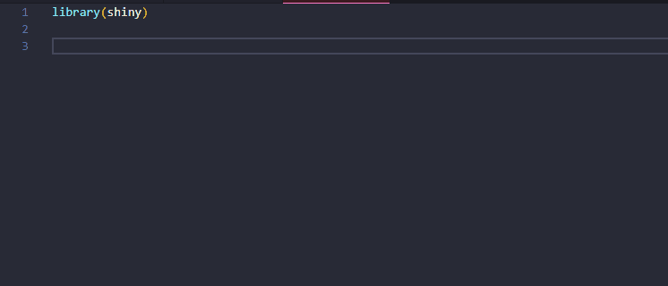

# shinysnip README

`shinysnip` is a VSCode Extension that allows you to generate R Shiny code snippets. Note that [Shiny](https://shiny.rstudio.com/) offers a LOT of functions 👽, as such `shinysnip` may not be exhaustive 🐤, if you notice a missing feature 🔬, feel free to open an issue or create a PR 🧑‍🚀. 

### `shinysnip` is licensed under GPL-v3 as such any modification of source code must be open sourced. For a commercial license, contact me by email. 

## Features

## Available Functions

If you've spotted a bug or wants a new feature, feel free to modify the following table: 

🟢 Done 
🍊 Implemented in the Development Version
🔴 Not Implemented Yet

|Function   | Status   |
|---|---|
|!fluidPage   | 🟢  |
|!sidebarLayout   | 🟢  |
|!textInput   | 🟢  |
|!sliderInput   | 🟢  |
|!navlistPanel   | 🟢  |
|!dateInputF   | 🟢  |
|!checkboxInput   | 🟢  |
|!checkboxG   | 🟢  |
|!fileInput   | 🟢  |
|!selectInput   | 🟢  |
|!textAreaInput   | 🟢  |
|!passwordInput   | 🟢  |
|!varSelectInput   | 🟢  |
|!radioButtons   | 🟢  |
|!plotOutput/renderPlot   | 🟢  |
|!imageOutput/renderImage   | 🟢  |
|!downloadButton/downloadHandler   | 🟢  |
|!tableOutput/renderTable   | 🟢  |
|!observeEvent   | 🟢  |
|!eventReactive   | 🟢  |
|!textOutput/renderText   | 🟢  |
|!textOutputPr/renderPrint   | 🟢  |
|!fluidRow/column  | 🟢  |
|!tabsetPanel  | 🟢  |
|!icon  | 🟢  |
|!navbarPage  | 🟢 |
|!reactive  | 🟢  |
|!dataTableOutput/renderDataTable  | 🟢 |
|!insertUI  | 🟢 |
|!removeUI  | 🟢 |
|!validate/need  | 🟢 |
|!navbarPage/navbarMenu  | 🟢 |
|!gt_output/render_gt  | 🟢 |
|!plotlyOutput/renderPlotly  | 🟢 |
|!insertTab | 🟢 |
|!style  | 🟢 |
|!prependTab  | 🟢 |
|!appendTab  | 🟢 |
|!showTab  | 🟢 |
|!hideTab  | 🟢 |
|!fillPage  | 🟢 |
|!fillRow  | 🟢 |
|!fillColumn  | 🟢 |
|!observe  | 🔴 |
|!req  | 🔴 |

## LOG

## 0.1.6

+ minor formatting stuff

## 0.1.5

+ better formatting of code

#### 0.1.4

+ fixing `observeEvent` bug

#### 0.1.3

Adding the following snippets: 
+ !insertUI
+ !removeUI
+ !validate/need
+ !navbarPage/navbarMenu
+ !gt_output/render_gt
+ !plotlyOutput/renderPlotly
+ !style
+ !insertTab
+ !prependTab
+ !appendTab
+ !removeTab
+ !showTab
+ !hideTab
+ !fillPage
+ !fillRow
+ !fillColumn

#### 0.1.2  

Adding the following snippets: 

+ !fluidRow/column 
+ !tabsetPanel
+ !icon
+ !reactive
+ !navbarPage
+ !dataTableOutput

#### 0.1.1 

Initial release

## Code of Conduct

Please note that the `shinysnip` project is released with a [Contributor Code of Conduct](https://contributor-covenant.org/version/2/0/CODE_OF_CONDUCT.html). By contributing to this project, you agree to abide by its terms.
